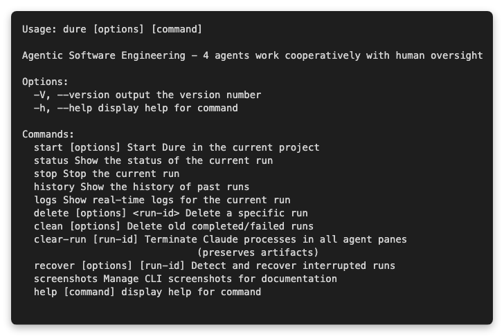

# Dure

> Named after the Korean tradition of "Dure" (cooperative farming),
> where villagers work together with distinct roles toward a shared goal.

[](https://github.com/choo121600/dure/actions/workflows/ci.yml)
[](https://codecov.io/gh/choo121600/dure)
[](https://opensource.org/licenses/MIT)

> Input your intent, four agents execute sequentially, and humans only review evidence and make decisions - an engineering system

Agentic Software Engineering MVP - A system where 4 AI agents generate code while humans only make decisions.

## Requirements

- **Node.js** 18.0.0 or higher
- **tmux** (terminal multiplexer)
- **Claude CLI** (`claude` command must be installed)

### Installing tmux

```bash
# macOS
brew install tmux

# Ubuntu/Debian
sudo apt-get install tmux

# CentOS/RHEL
sudo yum install tmux
```

## Installation

```bash
# Clone the repository
git clone <repository-url>
cd dure

# Install dependencies
npm install

# Build
npm run build

# Global installation (optional)
npm link
```

## Usage

### Basic Usage

```bash
# Navigate to your project folder
cd /path/to/your-project

# Start Dure
npx dure start

# Or if globally installed
dure start
```

The browser will automatically open and display the dashboard (http://localhost:3873).

### CLI Commands



```bash
# Specify port
dure start --port 3001

# Disable automatic browser opening
dure start --no-browser

# Check current run status
dure status

# Stop running run
dure stop

# Past run history
dure history

# Recover interrupted run
dure recover [run-id]

# List interrupted runs
dure recover --list
```

For the complete CLI reference, see [CLI Reference](docs/CLI_REFERENCE.md).

## Workflow

### 1. Start a New Run

1. Click "New Run" on the dashboard
2. Write your briefing (Markdown supported)
3. Click "Start Run"

### 2. Agent Pipeline

```
Refiner → Builder → Verifier → Gatekeeper
   ↓         ↓          ↓          ↓
briefing   code       test      final
 review   generation  execution  verdict
```

- **Refiner**: Reviews and improves the briefing
- **Builder**: Implements code
- **Verifier**: Generates and executes tests
- **Gatekeeper**: Final review and verdict

### 3. Human Intervention (CRP)

When an agent encounters a situation requiring judgment, it generates a **CRP (Consultation Request Pack)**:

1. Notification displayed on dashboard
2. Select options on CRP page
3. Enter decision rationale (optional)
4. Submit and restart agent

### 4. Final Review (MRP)

When Gatekeeper issues a PASS verdict, an **MRP (Merge-Readiness Pack)** is generated:

1. Summary of changes
2. Review test results
3. Approve or Request Changes

## Briefing Writing Guide

Good briefing example:

```markdown
# Implement Rate Limiter Middleware

## Requirements
- Implement as Express.js middleware
- IP-based request limiting
- 60 requests per minute limit
- Include Retry-After header in 429 response

## Constraints
- No external libraries (no express-rate-limit, etc.)
- Use in-memory storage

## Expected Behavior
- Normal request: pass to next middleware
- Rate exceeded: 429 Too Many Requests response
```

### Expressions to Avoid

The following expressions will trigger a CRP:
- "as appropriate", "as needed", "reasonable"
- "appropriate", "suitable"

Write specific numbers and clear requirements.

## Folder Structure

When Dure runs, a `.dure/` folder is created in your project:

```
.dure/
├── config/           # Agent configuration
│   ├── global.json
│   ├── refiner.json
│   ├── builder.json
│   ├── verifier.json
│   └── gatekeeper.json
│
└── runs/             # Run history
    └── run-{timestamp}/
        ├── state.json        # Current state
        ├── briefing/         # Briefing files
        ├── builder/          # Builder output
        ├── verifier/         # Test results
        ├── gatekeeper/       # Verdict results
        ├── crp/              # Human queries
        ├── vcr/              # Human responses
        └── mrp/              # Final deliverables
```

## Configuration

You can change settings via the Settings page or by directly editing `.dure/config/` files.

### Main Settings

| Setting | Default | Description |
|---------|---------|-------------|
| `global.max_iterations` | 3 | Maximum retry count |
| `global.web_port` | 3873 | Web server port |
| `refiner.model` | haiku | Refiner model |
| `builder.model` | sonnet | Builder model |
| `verifier.model` | haiku | Verifier model |
| `gatekeeper.model` | sonnet | Gatekeeper model |

### Model Selection

- **haiku**: Fast response, suitable for simple tasks
- **sonnet**: Balanced performance (recommended)
- **opus**: Highest quality, suitable for complex tasks

## tmux Session

Dure uses tmux to run agents in parallel:

```
┌──────────┬──────────┬──────────┬──────────┐
│ Refiner  │ Builder  │ Verifier │Gatekeeper│
│ (pane 0) │ (pane 1) │ (pane 2) │ (pane 3) │
├──────────┴──────────┴──────────┴──────────┤
│              Debug Shell (pane 4)          │
├────────────────────────────────────────────┤
│              ACE Server (pane 5)           │
└────────────────────────────────────────────┘
```

To directly connect to the tmux session:

```bash
tmux attach-session -t dure-run-{timestamp}
```

## Troubleshooting

### "tmux is not installed" error

Install tmux:
```bash
brew install tmux  # macOS
```

### "claude command not found" error

Make sure Claude CLI is installed and included in PATH.

### Agent stuck

1. Connect to tmux session to check agent status
2. Stop with `dure stop` and restart
3. Debug directly in Debug Shell (pane 4)

### Port conflict

```bash
dure start --port 3001
```

## Documentation

For detailed documentation, see the [official documentation site](https://choo121600.github.io/dure/).

- [Quick Start](https://choo121600.github.io/dure/#/guide/getting-started)
- [Briefing Writing Guide](https://choo121600.github.io/dure/#/guide/writing-briefings)
- [Architecture](https://choo121600.github.io/dure/#/architecture/overview)
- [API Reference](https://choo121600.github.io/dure/#/api/cli)

### View Documentation Locally

```bash
# Install Docsify CLI
npm install -g docsify-cli

# Run documentation server
docsify serve docs

# Access http://localhost:3873
```

## License

MIT

## Contributing

Issues and PRs are welcome. For details, see the [Contributing Guide](https://choo121600.github.io/dure/#/misc/contributing).
