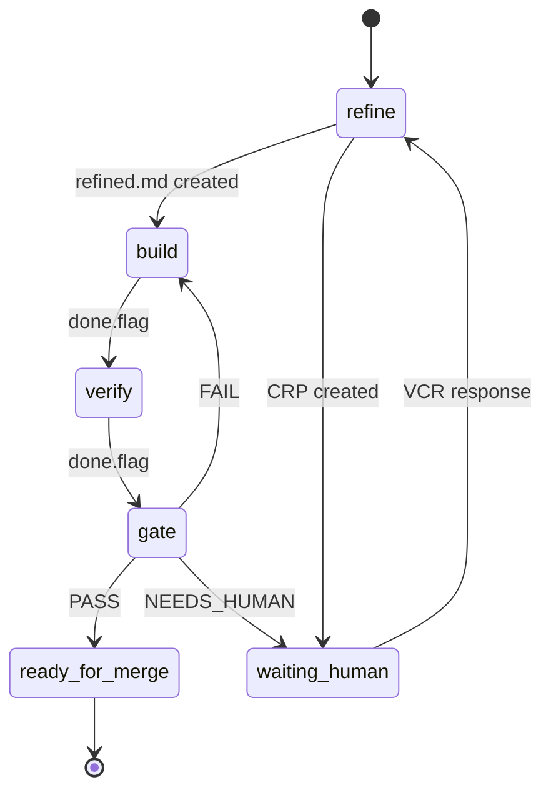
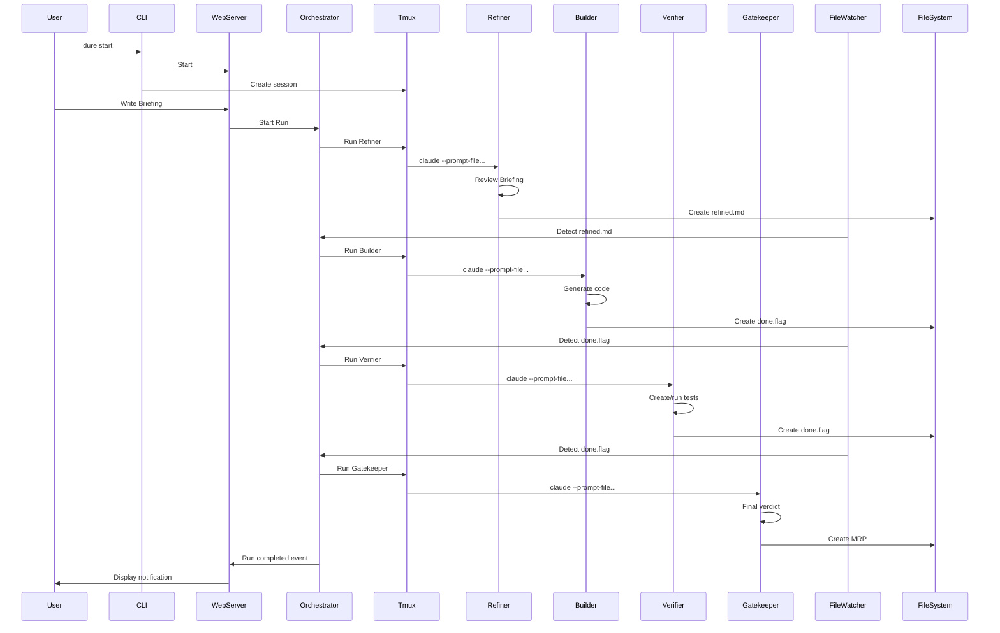

# System Overview

Describes the overall architecture of Dure.

## Layer Architecture

Dure는 4개의 레이어로 구성됩니다:

```
┌─────────────────────────────────────────────────────────────────────┐
│                      PRESENTATION LAYER                              │
│  ┌─────────────────────────┐     ┌───────────────────────────────┐  │
│  │   TUI Dashboard         │     │   Web Dashboard               │  │
│  │   (Primary Interface)   │     │   (Secondary Interface)       │  │
│  │                         │     │                               │  │
│  │   Ink React Components  │     │   Socket.io + REST API        │  │
│  │   src/tui/ink/          │     │   src/server/dashboard/       │  │
│  └────────────┬────────────┘     └───────────────┬───────────────┘  │
│               │                                  │                   │
│               └──────────────┬───────────────────┘                   │
│                              ▼                                       │
│               ┌──────────────────────────────┐                       │
│               │   DashboardDataProvider      │                       │
│               │   src/core/dashboard-data-   │                       │
│               │   provider.ts                │                       │
│               └──────────────┬───────────────┘                       │
├──────────────────────────────┼──────────────────────────────────────┤
│                      CORE LAYER                                      │
│               ┌──────────────▼───────────────┐                       │
│               │        Orchestrator          │                       │
│               │    src/core/orchestrator.ts  │                       │
│               └──────────────┬───────────────┘                       │
│                              │                                       │
│    ┌─────────────────────────┼─────────────────────────┐            │
│    │                         │                         │            │
│    ▼                         ▼                         ▼            │
│  ┌───────────────┐   ┌───────────────┐   ┌─────────────────────┐   │
│  │ StateManager  │   │ TmuxManager   │   │   FileWatcher       │   │
│  │               │   │               │   │                     │   │
│  │ state.json    │   │ tmux sessions │   │   chokidar          │   │
│  │ read/write    │   │ pane control  │   │   event detection   │   │
│  └───────────────┘   └───────────────┘   └─────────────────────┘   │
│                                                                      │
├──────────────────────────────────────────────────────────────────────┤
│                      AGENT LAYER                                     │
│  ┌────────────────────────────────────────────────────────────────┐ │
│  │                      tmux session                               │ │
│  │  ┌──────────┬──────────┬──────────┬──────────┬──────────────┐  │ │
│  │  │ Refiner  │ Builder  │ Verifier │Gatekeeper│ Debug Shell  │  │ │
│  │  │ (pane 0) │ (pane 1) │ (pane 2) │ (pane 3) │ (pane 4)     │  │ │
│  │  └──────────┴──────────┴──────────┴──────────┴──────────────┘  │ │
│  │  각 pane에서 claude CLI가 headless 모드로 실행됨               │ │
│  └────────────────────────────────────────────────────────────────┘ │
│                                                                      │
├──────────────────────────────────────────────────────────────────────┤
│                      STORAGE LAYER                                   │
│  ┌────────────────────────────────────────────────────────────────┐ │
│  │  .dure/                                                         │ │
│  │    ├─ config/      # 에이전트별 설정                            │ │
│  │    └─ runs/        # 실행 기록 (state.json, artifacts)          │ │
│  └────────────────────────────────────────────────────────────────┘ │
│                                                                      │
└──────────────────────────────────────────────────────────────────────┘
```

## Core Components

### 0. Presentation Layer (NEW)

#### TUI Dashboard (Primary)

**Role:** 기본 모니터링 인터페이스

**위치:** `src/tui/`

**책임:**
- 실행 상태 실시간 표시
- 에이전트 출력 스트리밍
- CRP 인라인 응답
- 키보드 단축키 처리

**기술 스택:**
- Ink (React for CLI)
- TypeScript

**주요 컴포넌트:**

| 컴포넌트 | 파일 | 역할 |
|----------|------|------|
| App | `src/tui/ink/App.tsx` | 메인 컴포넌트, 키보드 입력 처리 |
| Header | `src/tui/ink/Header.tsx` | Run ID, Stage, 토큰/비용 표시 |
| AgentPanel | `src/tui/ink/AgentPanel.tsx` | 에이전트 상태 표시 |
| OutputView | `src/tui/ink/OutputView.tsx` | 선택된 에이전트 출력 |
| ProgressBar | `src/tui/ink/ProgressBar.tsx` | 진행률 표시 |
| CRPPrompt | `src/tui/ink/CRPPrompt.tsx` | CRP 응답 입력 |

**키보드 단축키:**

| 키 | 동작 |
|----|------|
| `1-4` | 에이전트 선택 (Refiner, Builder, Verifier, Gatekeeper) |
| `q` | TUI 종료 |
| `d` | Detach (백그라운드 전환) |

#### Web Dashboard (Secondary)

**Role:** 원격/웹 기반 모니터링 인터페이스

**위치:** `src/server/dashboard/`

**책임:**
- Socket.io를 통한 실시간 업데이트
- REST API 엔드포인트 제공
- CRP 웹 폼 응답

**기술 스택:**
- Socket.io
- Express.js

**Socket Events:** [docs/api/socket-events.md](/api/socket-events.md) 참조

#### DashboardDataProvider

**Role:** 대시보드 데이터 집계 레이어

**위치:** `src/core/dashboard-data-provider.ts:100`

**책임:**
- Orchestrator 이벤트 구독
- StateManager에서 상태 로드
- TmuxManager에서 pane 출력 캡처
- DashboardData 생성 및 이벤트 발행

**주요 메서드:**

| 메서드 | 설명 |
|--------|------|
| `getData()` | 현재 DashboardData 스냅샷 반환 |
| `startPolling(intervalMs?)` | 폴링 시작 (기본 500ms) |
| `stopPolling()` | 폴링 중지 |

**발행 이벤트:**

| 이벤트 | 페이로드 | 설명 |
|--------|----------|------|
| `update` | `DashboardData` | 전체 상태 업데이트 |
| `stage-change` | `{ previousStage, newStage }` | 단계 변경 |
| `agent-status-change` | `{ agent, previousStatus, newStatus }` | 에이전트 상태 변경 |
| `crp` | `DashboardCRP` | CRP 발생 |

---

### 1. CLI (Command Line Interface)

**Role:** User entry point

**Responsibilities:**
- Initialize Dure
- Create tmux session
- Start web server
- Query status (`status`, `history`)
- **TUI 대시보드 실행** (기본 동작)

**Technology:**
- Node.js + TypeScript
- Commander.js (CLI framework)

### 2. ACE Web Server

**Role:** Web-based control interface

**Responsibilities:**
- Run creation and management
- Real-time status monitoring
- CRP/VCR interface
- MRP review interface

**Technology:**
- Express.js (web framework)
- Socket.io (real-time communication)
- HTML/CSS/JS (frontend)

**Main Routes:**

| Path | Method | Description |
|------|--------|-------------|
| `/` | GET | Dashboard |
| `/api/runs` | GET | Run list |
| `/api/runs` | POST | Start new Run |
| `/api/runs/:id` | GET | Run details |
| `/api/crp/:id` | GET | Get CRP |
| `/api/crp/:id` | POST | Submit VCR |
| `/api/mrp/:id` | GET | Get MRP |

### 3. Tmux Session Manager

**Role:** Agent process isolation

**Responsibilities:**
- Create independent tmux session for each Run
- Configure 6-pane layout
- Start/stop agent processes
- Capture logs

**Layout:**

```
┌──────────────────────────────────────────────────────────┐
│                dure-run-{timestamp}                 │
├──────────────┬──────────────┬──────────────┬─────────────┤
│   Refiner    │   Builder    │   Verifier   │Gatekeeper   │
│              │              │              │             │
├──────────────┴──────────────┴──────────────┴─────────────┤
│                    Debug Shell                            │
├──────────────────────────────────────────────────────────┤
│                    ACE Server                             │
└──────────────────────────────────────────────────────────┘
```

### 4. Orchestrator

**Role:** Agent execution coordination

**Responsibilities:**
- Phase transition management
- Done flag detection
- Sequential agent execution
- Error handling and retry
- Event publishing

**State Machine:**



### 5. File Watcher

**Role:** File system event detection

**Responsibilities:**
- Detect `done.flag` creation
- Detect `crp/` files
- Detect `vcr/` files
- Trigger events

**Technology:**
- chokidar (file watching library)

### 6. State Manager

**Role:** Run state management

**Responsibilities:**
- Read/write `state.json`
- State updates
- State validation
- History recording

**State Structure:**

```typescript
interface RunState {
  run_id: string;
  phase: 'refine' | 'build' | 'verify' | 'gate' | 'ready_for_merge';
  iteration: number;
  max_iterations: number;
  agents: {
    [agentName: string]: AgentStatus;
  };
  usage: UsageInfo;
  pending_crp?: string;
  errors: Error[];
  history: HistoryEntry[];
}
```

### 7. Usage Tracker

**Role:** Token usage and cost tracking

**Responsibilities:**
- Collect Claude API usage
- Calculate costs
- Aggregate per agent
- Real-time updates

**Cost Calculation:**

```typescript
const PRICING = {
  haiku: { input: 0.25, output: 1.25 },    // per 1M tokens
  sonnet: { input: 3.00, output: 15.00 },
  opus: { input: 15.00, output: 75.00 }
};

function calculateCost(model, inputTokens, outputTokens) {
  const pricing = PRICING[model];
  return (
    (inputTokens / 1_000_000) * pricing.input +
    (outputTokens / 1_000_000) * pricing.output
  );
}
```

## Data Flow

### From Run Start to Completion



## Communication Mechanisms

### 1. File-Based Coordination

Communication between agents is done through the **file system**:

```
Refiner → refined.md → Builder
Builder → done.flag → Verifier
Verifier → done.flag → Gatekeeper
```

**Advantages:**
- Clear interface
- Easy debugging (can directly check files)
- Reproducible (all intermediate artifacts preserved)
- Agent independence (process isolation)

**Disadvantages:**
- Low real-time capability (requires polling)
- File I/O overhead

### 2. WebSocket (Real-time Updates)

The web UI receives real-time status via **WebSocket**:

```typescript
// Server → Client
socket.emit('agent.started', { agent: 'builder' });
socket.emit('agent.completed', { agent: 'builder', duration_ms: 45000 });
socket.emit('phase.changed', { from: 'build', to: 'verify' });

// Client → Server
socket.emit('retry.agent', { agent: 'builder' });
socket.emit('stop.run', {});
```

### 3. Event Bus

Internal **EventEmitter**-based event bus:

```typescript
eventBus.on('agent.completed', (data) => {
  // Start next agent
  orchestrator.startNextAgent();

  // Broadcast via websocket
  io.emit('agent.completed', data);

  // Log recording
  logger.info('Agent completed', data);
});
```

## Error Handling

### Error Types

| Type | Recoverable | Handling Method |
|------|-------------|-----------------|
| `crash` | Yes | Auto retry (max 2 times) |
| `timeout` | Yes | Extend timeout or retry |
| `validation` | Yes | Auto retry |
| `permission` | No | Immediate stop, human intervention |
| `resource` | No | Immediate stop, human intervention |

### Auto Retry Logic

```typescript
async function runAgentWithRetry(agent: Agent, maxRetries = 2) {
  for (let attempt = 1; attempt <= maxRetries; attempt++) {
    try {
      const result = await agent.run();
      return result;
    } catch (error) {
      if (!isRecoverable(error) || attempt === maxRetries) {
        throw error;
      }

      logger.warn(`Agent ${agent.name} failed, retrying (${attempt}/${maxRetries})`);
      await sleep(5000); // Wait 5 seconds before retry
    }
  }
}
```

## Security Considerations

### 1. Claude CLI Permissions

Agents are run with the `--dangerously-skip-permissions` flag:

```bash
claude --dangerously-skip-permissions --prompt-file ...
```

Warning: Agents have access to all files in the project.

### 2. File System Isolation

Each Run has an independent folder:

```
.dure/runs/
├── run-20240126-143022/  # Run 1
└── run-20240126-150000/  # Run 2
```

### 3. Input Validation

Briefing and VCR inputs are validated:

```typescript
function validateBriefing(content: string): void {
  if (content.length > 100000) {
    throw new Error('Briefing too long');
  }

  if (content.includes('<script>')) {
    throw new Error('Invalid content');
  }
}
```

## Scalability

### Horizontal Scaling (Future)

Currently runs on a single machine, but in the future:

- Run agents on separate machines
- Shared file system (NFS, S3, etc.)
- Distributed event bus (Redis Pub/Sub, etc.)

### Vertical Scaling

- Use more powerful models (Opus)
- Support parallel Runs (currently sequential)
- Parallel agent execution (for independent tasks)

## Technology Stack Summary

| Component | Technology |
|-----------|------------|
| **Runtime** | Node.js 18+ |
| **Language** | TypeScript |
| **CLI** | Commander.js |
| **TUI** | Ink (React for CLI) |
| **Web Framework** | Express.js |
| **Real-time Communication** | Socket.io |
| **File Watching** | chokidar |
| **Process Management** | tmux |
| **AI Agent** | Claude CLI |
| **Testing** | Vitest |

## Next Steps

- [Dashboard System](/architecture/dashboard-system.md) - TUI/Web 대시보드 아키텍처
- [Agent Design](/architecture/agents.md) - Detailed agent design
- [File Structure](/architecture/file-structure.md) - Detailed folder structure
- [Execution Flow](/architecture/execution-flow.md) - Detailed execution process
- [Data Formats](/architecture/data-formats.md) - File format specifications
