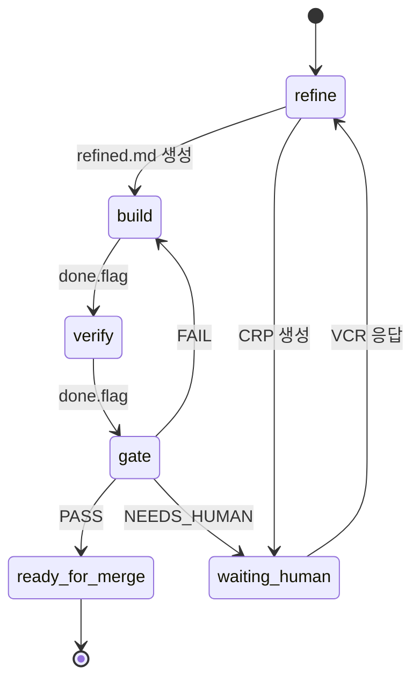
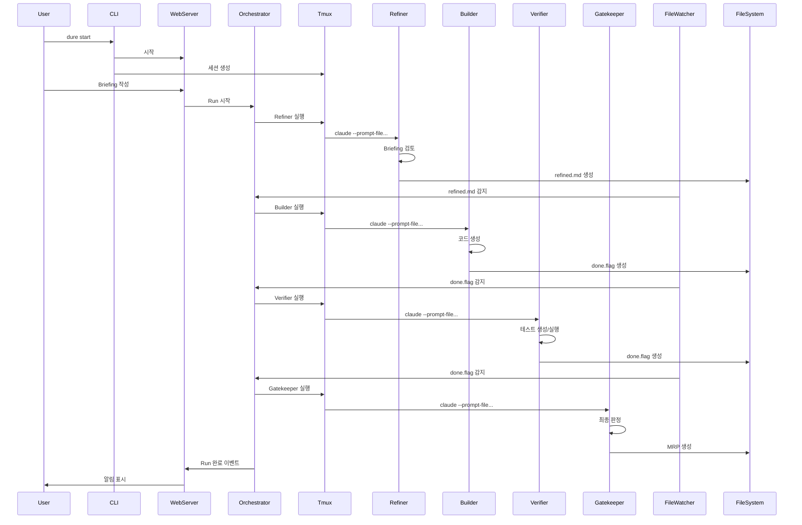

# 시스템 개요

Dure의 전체 아키텍처를 설명합니다.

## 아키텍처 다이어그램

```
┌─────────────────────────────────────────────────────────────┐
│                         dure                           │
├─────────────────────────────────────────────────────────────┤
│                                                              │
│   CLI (dure start)                                     │
│         │                                                    │
│         ▼                                                    │
│   ┌─────────────┐         ┌─────────────────────────────┐   │
│   │ ACE Web     │◄───────►│ .dure/                │   │
│   │ Server      │         │   ├─ config/                │   │
│   │ :3000       │         │   └─ runs/                  │   │
│   └─────────────┘         └─────────────────────────────┘   │
│         │                              ▲                     │
│         │ Run 시작                     │                     │
│         ▼                              │                     │
│   ┌─────────────────────────────────────────────────────┐   │
│   │                  tmux session                        │   │
│   │  ┌──────────┬──────────┬──────────┬──────────┐      │   │
│   │  │ Refiner  │ Builder  │ Verifier │Gatekeeper│      │   │
│   │  │ (pane 0) │ (pane 1) │ (pane 2) │ (pane 3) │      │   │
│   │  └──────────┴──────────┴──────────┴──────────┘      │   │
│   │  ┌─────────────────────┬────────────────────┐       │   │
│   │  │ Debug Shell (pane 4)│ ACE Server (pane 5)│       │   │
│   │  └─────────────────────┴────────────────────┘       │   │
│   └─────────────────────────────────────────────────────┘   │
│                                                              │
└─────────────────────────────────────────────────────────────┘
```

## 핵심 구성요소

### 1. CLI (Command Line Interface)

**역할:** 사용자 진입점

**책임:**
- Dure 초기화
- tmux 세션 생성
- 웹 서버 시작
- 상태 조회 (`status`, `history`)

**기술:**
- Node.js + TypeScript
- Commander.js (CLI 프레임워크)

### 2. ACE Web Server

**역할:** 웹 기반 제어 인터페이스

**책임:**
- Run 생성 및 관리
- 실시간 상태 모니터링
- CRP/VCR 인터페이스
- MRP 검토 인터페이스

**기술:**
- Express.js (웹 프레임워크)
- Socket.io (실시간 통신)
- HTML/CSS/JS (프론트엔드)

**주요 라우트:**

| 경로 | 메서드 | 설명 |
|------|--------|------|
| `/` | GET | 대시보드 |
| `/api/runs` | GET | Run 목록 |
| `/api/runs` | POST | 새 Run 시작 |
| `/api/runs/:id` | GET | Run 상세 |
| `/api/crp/:id` | GET | CRP 조회 |
| `/api/crp/:id` | POST | VCR 제출 |
| `/api/mrp/:id` | GET | MRP 조회 |

### 3. Tmux Session Manager

**역할:** 에이전트 프로세스 격리

**책임:**
- 각 Run마다 독립된 tmux 세션 생성
- 6개 pane 레이아웃 구성
- 에이전트 프로세스 시작/중지
- 로그 캡처

**레이아웃:**

```
┌──────────────────────────────────────────────────────────┐
│                dure-run-{timestamp}                 │
├──────────────┬──────────────┬──────────────┬─────────────┤
│   Refiner    │   Builder    │   Verifier   │Gatekeeper   │
│              │              │              │             │
├──────────────┴──────────────┴──────────────┴─────────────┤
│                    Debug Shell                            │
├──────────────────────────────────────────────────────────┤
│                    ACE Server                             │
└──────────────────────────────────────────────────────────┘
```

### 4. Orchestrator

**역할:** 에이전트 실행 조율

**책임:**
- Phase 전환 관리
- Done flag 감지
- 에이전트 순차 실행
- 에러 처리 및 재시도
- 이벤트 발행

**상태 기계:**



### 5. File Watcher

**역할:** 파일 시스템 이벤트 감지

**책임:**
- `done.flag` 생성 감지
- `crp/` 파일 감지
- `vcr/` 파일 감지
- 이벤트 트리거

**기술:**
- chokidar (파일 감시 라이브러리)

### 6. State Manager

**역할:** Run 상태 관리

**책임:**
- `state.json` 읽기/쓰기
- 상태 업데이트
- 상태 검증
- 히스토리 기록

**상태 구조:**

```typescript
interface RunState {
  run_id: string;
  phase: 'refine' | 'build' | 'verify' | 'gate' | 'ready_for_merge';
  iteration: number;
  max_iterations: number;
  agents: {
    [agentName: string]: AgentStatus;
  };
  usage: UsageInfo;
  pending_crp?: string;
  errors: Error[];
  history: HistoryEntry[];
}
```

### 7. Usage Tracker

**역할:** 토큰 사용량 및 비용 추적

**책임:**
- Claude API 사용량 수집
- 비용 계산
- 에이전트별 집계
- 실시간 업데이트

**비용 계산:**

```typescript
const PRICING = {
  haiku: { input: 0.25, output: 1.25 },    // per 1M tokens
  sonnet: { input: 3.00, output: 15.00 },
  opus: { input: 15.00, output: 75.00 }
};

function calculateCost(model, inputTokens, outputTokens) {
  const pricing = PRICING[model];
  return (
    (inputTokens / 1_000_000) * pricing.input +
    (outputTokens / 1_000_000) * pricing.output
  );
}
```

## 데이터 흐름

### Run 시작부터 완료까지



## 통신 메커니즘

### 1. 파일 기반 조율

에이전트 간 통신은 **파일시스템**으로 이루어집니다:

```
Refiner → refined.md → Builder
Builder → done.flag → Verifier
Verifier → done.flag → Gatekeeper
```

**장점:**
- ✅ 명확한 인터페이스
- ✅ 디버깅 용이 (파일 직접 확인)
- ✅ 재현 가능 (모든 중간 산출물 보존)
- ✅ 에이전트 독립성 (프로세스 격리)

**단점:**
- ❌ 실시간성 낮음 (폴링 필요)
- ❌ 파일 I/O 오버헤드

### 2. WebSocket (실시간 업데이트)

웹 UI는 **WebSocket**으로 실시간 상태를 받습니다:

```typescript
// 서버 → 클라이언트
socket.emit('agent.started', { agent: 'builder' });
socket.emit('agent.completed', { agent: 'builder', duration_ms: 45000 });
socket.emit('phase.changed', { from: 'build', to: 'verify' });

// 클라이언트 → 서버
socket.emit('retry.agent', { agent: 'builder' });
socket.emit('stop.run', {});
```

### 3. 이벤트 버스

내부적으로 **EventEmitter** 기반 이벤트 버스:

```typescript
eventBus.on('agent.completed', (data) => {
  // 다음 에이전트 시작
  orchestrator.startNextAgent();

  // 웹소켓으로 브로드캐스트
  io.emit('agent.completed', data);

  // 로그 기록
  logger.info('Agent completed', data);
});
```

## 에러 처리

### 에러 유형

| 유형 | 복구 가능 | 처리 방법 |
|------|----------|----------|
| `crash` | Yes | 자동 재시도 (최대 2회) |
| `timeout` | Yes | 타임아웃 연장 또는 재시도 |
| `validation` | Yes | 자동 재시도 |
| `permission` | No | 즉시 중단, 인간 개입 |
| `resource` | No | 즉시 중단, 인간 개입 |

### 자동 재시도 로직

```typescript
async function runAgentWithRetry(agent: Agent, maxRetries = 2) {
  for (let attempt = 1; attempt <= maxRetries; attempt++) {
    try {
      const result = await agent.run();
      return result;
    } catch (error) {
      if (!isRecoverable(error) || attempt === maxRetries) {
        throw error;
      }

      logger.warn(`Agent ${agent.name} failed, retrying (${attempt}/${maxRetries})`);
      await sleep(5000); // 5초 대기 후 재시도
    }
  }
}
```

## 보안 고려사항

### 1. Claude CLI 권한

에이전트는 `--dangerously-skip-permissions` 플래그로 실행됩니다:

```bash
claude --dangerously-skip-permissions --prompt-file ...
```

⚠️ **주의:** 에이전트는 프로젝트 내 모든 파일에 접근 가능합니다.

### 2. 파일 시스템 격리

각 Run은 독립된 폴더:

```
.dure/runs/
├── run-20240126-143022/  # Run 1
└── run-20240126-150000/  # Run 2
```

### 3. 입력 검증

Briefing 및 VCR 입력은 검증됩니다:

```typescript
function validateBriefing(content: string): void {
  if (content.length > 100000) {
    throw new Error('Briefing too long');
  }

  if (content.includes('<script>')) {
    throw new Error('Invalid content');
  }
}
```

## 확장성

### 수평 확장 (향후)

현재는 단일 머신에서 실행되지만, 향후:

- 에이전트를 별도 머신에서 실행
- 공유 파일시스템 (NFS, S3 등)
- 분산 이벤트 버스 (Redis Pub/Sub 등)

### 수직 확장

- 더 강력한 모델 사용 (Opus)
- 병렬 Run 지원 (현재는 순차)
- 에이전트 병렬 실행 (독립적인 작업)

## 기술 스택 요약

| 구성요소 | 기술 |
|---------|------|
| **런타임** | Node.js 18+ |
| **언어** | TypeScript |
| **CLI** | Commander.js |
| **웹 프레임워크** | Express.js |
| **실시간 통신** | Socket.io |
| **파일 감시** | chokidar |
| **프로세스 관리** | tmux |
| **AI 에이전트** | Claude CLI |
| **테스트** | Vitest |

## 다음 단계

- [에이전트 설계](/architecture/agents.md) - 에이전트 상세 설계
- [파일 구조](/architecture/file-structure.md) - 폴더 구조 상세
- [실행 흐름](/architecture/execution-flow.md) - 실행 과정 상세
- [데이터 포맷](/architecture/data-formats.md) - 파일 포맷 명세
