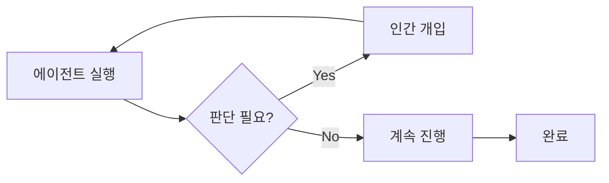
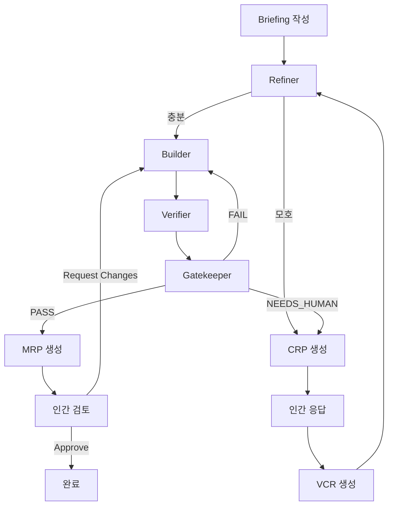

# 핵심 개념

Dure을 효과적으로 사용하기 위해 이해해야 할 핵심 개념들을 설명합니다.

## 설계 원칙

Dure은 다음 원칙에 따라 설계되었습니다:

### 1. 인간은 판단 노드다

**인간은 작업자가 아니라 결정권자입니다.**



- ✅ 에이전트가 모든 작업 수행
- ✅ 인간은 중요한 결정만 내림
- ❌ 인간이 직접 코드 작성하지 않음
- ❌ 인간이 중간 과정에 개입하지 않음

### 2. 궤적(Trajectory)이 1급 산출물

**결과물보다 도달 과정이 중요합니다.**

모든 실행은 완전히 기록되어:

- 📝 모든 에이전트 로그
- 🔍 모든 결정 근거
- ⏱️ 모든 이벤트 타임스탬프
- 💰 모든 토큰 사용량

이 정보는 `.dure/runs/{run_id}/` 에 영구 저장됩니다.

### 3. 재현 가능해야 한다

같은 Briefing과 설정으로 실행하면 유사한 결과를 얻을 수 있어야 합니다.

```bash
# 과거 run 재현
dure replay run-20240126-143022
```

### 4. 파일 기반 조율

에이전트 간 통신은 파일시스템으로 이루어집니다:

```
Refiner → briefing/refined.md → Builder
Builder → builder/done.flag → Verifier
Verifier → verifier/done.flag → Gatekeeper
```

이는:
- ✅ 명확한 인터페이스
- ✅ 디버깅 용이
- ✅ 중간 상태 검사 가능

## 주요 용어

### Run

하나의 Briefing부터 최종 MRP까지의 전체 실행 단위입니다.

각 Run은 고유한 ID를 가집니다:

```
run-{timestamp}
예: run-20240126-143022
```

### Phase

Run은 4개의 Phase로 구성됩니다:

| Phase | 에이전트 | 역할 |
|-------|---------|------|
| **0: refine** | Refiner | Briefing 검토 및 개선 |
| **1: build** | Builder | 코드 구현 |
| **2: verify** | Verifier | 테스트 생성 및 실행 |
| **3: gate** | Gatekeeper | 최종 판정 |

### Iteration

Gatekeeper가 FAIL 판정을 내리면 Builder로 돌아가 재시도합니다.

```
Phase 1 (Builder) → Phase 2 (Verifier) → Phase 3 (Gatekeeper)
                        ↑                          │
                        └──────── FAIL ────────────┘
```

기본 최대 iteration: **3회**

?> `config.global.max_iterations`로 변경 가능

### Briefing

인간이 작성하는 **요구사항 명세서**입니다.

Markdown 형식으로 작성하며, 다음을 포함합니다:

- 📋 요구사항
- 🚫 제약 조건
- ✅ 예상 동작

좋은 Briefing 작성법은 [Briefing 작성 가이드](/guide/writing-briefings.md)를 참고하세요.

### CRP (Consultation Request Pack)

에이전트가 **인간의 판단이 필요할 때** 생성하는 질의서입니다.

CRP에는 다음이 포함됩니다:

```json
{
  "question": "질문 내용",
  "context": "맥락 설명",
  "options": [
    {"id": "A", "label": "선택지A", "description": "...", "risk": "낮음"},
    {"id": "B", "label": "선택지B", "description": "...", "risk": "높음"}
  ],
  "recommendation": "A"
}
```

인간이 응답하면 **VCR**이 생성됩니다.

### VCR (Version Controlled Resolution)

CRP에 대한 **인간의 결정 기록**입니다.

```json
{
  "crp_id": "crp-001",
  "decision": "A",
  "rationale": "MVP에서는 단순한 방식으로 시작",
  "applies_to_future": true
}
```

`applies_to_future: true`로 설정하면 유사한 상황에서 자동으로 적용됩니다.

### MRP (Merge-Readiness Pack)

Gatekeeper가 PASS 판정을 내렸을 때 생성되는 **최종 결과물 패키지**입니다.

MRP에는 다음이 포함됩니다:

- 📄 `summary.md` - 변경 사항 요약
- 💾 `code/` - 최종 코드 스냅샷
- 🧪 `tests/` - 테스트 파일
- 📊 `evidence.json` - 테스트 결과, 비용, 로그 링크

## 에이전트 파이프라인

### 전체 흐름



### 각 에이전트의 역할

#### Refiner (Phase 0)

**Briefing을 검토하고 개선합니다.**

- ✅ 충분한 Briefing → 다음 단계로
- ✏️ 개선 가능 → 자동 보완 (숫자, 네이밍 등)
- ❓ 모호함 → CRP 생성

**자동 개선 허용 항목:**
- 숫자 기본값 (예: "적절한 제한" → "60회/분")
- 네이밍 컨벤션
- 파일 경로

**CRP 필수 항목:**
- 아키텍처 결정
- 외부 의존성 추가
- 보안 관련 사항

#### Builder (Phase 1)

**코드를 구현합니다.**

- 📝 `refined.md` 기반으로 코드 생성
- 📋 설계 결정 근거를 `log.md`에 기록
- ✅ 완료 시 `done.flag` 생성

#### Verifier (Phase 2)

**테스트를 생성하고 실행합니다.**

- 🧪 기능 테스트 생성
- 🔍 경계 조건 테스트
- ⚠️ 에러 케이스 테스트
- 🎯 반례 탐색 (adversarial testing)

**출력:**
- `tests/` - 테스트 파일
- `results.json` - 테스트 결과
- `log.md` - 검증 로그

#### Gatekeeper (Phase 3)

**최종 판정을 내립니다.**

판정 결과:

| 판정 | 의미 | 다음 단계 |
|------|------|----------|
| **PASS** | 모든 기준 충족 | MRP 생성 |
| **FAIL** | 기준 미충족 | Builder 재시도 |
| **NEEDS_HUMAN** | 인간 판단 필요 | CRP 생성 |

## 상태 관리

각 Run의 상태는 `state.json`에 저장됩니다:

```json
{
  "run_id": "run-20240126-143022",
  "phase": "build",
  "iteration": 1,
  "max_iterations": 3,
  "agents": {
    "refiner": {"status": "completed"},
    "builder": {"status": "running"},
    "verifier": {"status": "pending"},
    "gatekeeper": {"status": "pending"}
  }
}
```

**에이전트 상태:**

- `pending` - 아직 시작 안 됨
- `running` - 실행 중
- `completed` - 정상 완료
- `failed` - 에러로 실패
- `timeout` - 시간 초과
- `waiting_human` - 인간 입력 대기 중

## 비용 추적

모든 에이전트의 토큰 사용량과 비용이 실시간으로 추적됩니다:

```json
{
  "usage": {
    "by_agent": {
      "refiner": {"input": 2100, "output": 800, "cost": 0.002},
      "builder": {"input": 15300, "output": 4200, "cost": 0.058}
    },
    "total": {
      "input_tokens": 17400,
      "output_tokens": 5000,
      "cost_usd": 0.060
    }
  }
}
```

대시보드에서 실시간으로 확인할 수 있습니다.

## 다음 단계

- [Briefing 작성 가이드](/guide/writing-briefings.md) - 효과적인 Briefing 작성 방법
- [에이전트 이해하기](/guide/understanding-agents.md) - 각 에이전트의 상세 동작
- [시스템 개요](/architecture/overview.md) - 아키텍처 상세 설명
