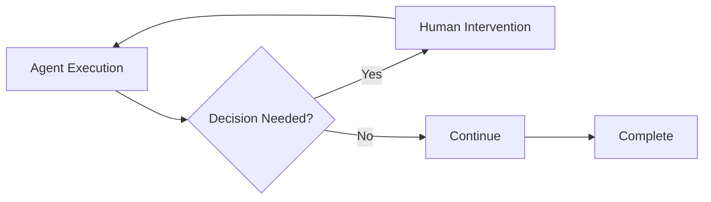
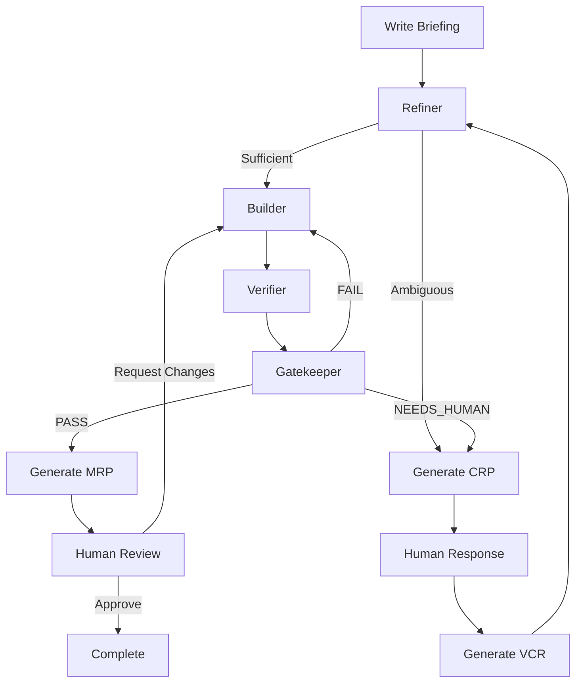

# Core Concepts

This explains the core concepts you need to understand to use Dure effectively.

## Design Principles

Dure is designed according to the following principles:

### 1. Humans are Decision Nodes

**Humans are decision makers, not workers.**



- ✅ Agents perform all work
- ✅ Humans only make important decisions
- ❌ Humans don't write code directly
- ❌ Humans don't intervene in intermediate processes

### 2. Trajectory is a First-Class Artifact

**The journey is more important than the destination.**

Every execution is fully recorded:

- 📝 All agent logs
- 🔍 All decision rationales
- ⏱️ All event timestamps
- 💰 All token usage

This information is permanently stored in `.dure/runs/{run_id}/`.

### 3. Must be Reproducible

Running with the same Briefing and settings should yield similar results.

```bash
# Replay past run
dure replay run-20240126-143022
```

### 4. File-Based Coordination

Communication between agents is done through the filesystem:

```
Refiner → briefing/refined.md → Builder
Builder → builder/done.flag → Verifier
Verifier → verifier/done.flag → Gatekeeper
```

This provides:
- ✅ Clear interfaces
- ✅ Easy debugging
- ✅ Ability to inspect intermediate states

## Key Terms

### Run

A complete execution unit from a single Briefing to the final MRP.

Each Run has a unique ID:

```
run-{timestamp}
e.g., run-20240126-143022
```

### Phase

A Run consists of 4 Phases:

| Phase | Agent | Role |
|-------|-------|------|
| **0: refine** | Refiner | Review and improve Briefing |
| **1: build** | Builder | Implement code |
| **2: verify** | Verifier | Generate and run tests |
| **3: gate** | Gatekeeper | Final judgment |

### Iteration

If the Gatekeeper gives a FAIL judgment, it returns to the Builder for retry.

```
Phase 1 (Builder) → Phase 2 (Verifier) → Phase 3 (Gatekeeper)
                        ↑                          │
                        └──────── FAIL ────────────┘
```

Default maximum iterations: **3**

?> Can be changed with `config.global.max_iterations`

### Briefing

A **requirements specification** written by humans.

Written in Markdown format, it includes:

- 📋 Requirements
- 🚫 Constraints
- ✅ Expected behavior

For good Briefing writing practices, see the [Briefing Writing Guide](/guide/writing-briefings.md).

### CRP (Consultation Request Pack)

A query document generated when an agent **needs human judgment**.

CRP includes:

```json
{
  "question": "Question content",
  "context": "Context explanation",
  "options": [
    {"id": "A", "label": "Option A", "description": "...", "risk": "low"},
    {"id": "B", "label": "Option B", "description": "...", "risk": "high"}
  ],
  "recommendation": "A"
}
```

When a human responds, a **VCR** is generated.

### VCR (Version Controlled Resolution)

A **record of human decisions** for CRP.

```json
{
  "crp_id": "crp-001",
  "decision": "A",
  "rationale": "Start with simple approach for MVP",
  "applies_to_future": true
}
```

Setting `applies_to_future: true` automatically applies to similar situations.

### MRP (Merge-Readiness Pack)

A **final deliverable package** generated when the Gatekeeper gives a PASS judgment.

MRP includes:

- 📄 `summary.md` - Summary of changes
- 💾 `code/` - Final code snapshot
- 🧪 `tests/` - Test files
- 📊 `evidence.json` - Test results, costs, log links

## Agent Pipeline

### Overall Flow



### Role of Each Agent

#### Refiner (Phase 0)

**Reviews and improves the Briefing.**

- ✅ Sufficient Briefing → Proceed to next step
- ✏️ Can be improved → Auto-supplement (numbers, naming, etc.)
- ❓ Ambiguous → Generate CRP

**Allowed Auto-improvements:**
- Numeric defaults (e.g., "appropriate limit" → "60/minute")
- Naming conventions
- File paths

**CRP Required Items:**
- Architecture decisions
- Adding external dependencies
- Security-related matters

#### Builder (Phase 1)

**Implements the code.**

- 📝 Generate code based on `refined.md`
- 📋 Record design decision rationale in `log.md`
- ✅ Create `done.flag` upon completion

#### Verifier (Phase 2)

**Generates and runs tests.**

- 🧪 Generate functional tests
- 🔍 Boundary condition tests
- ⚠️ Error case tests
- 🎯 Adversarial testing

**Output:**
- `tests/` - Test files
- `results.json` - Test results
- `log.md` - Verification log

#### Gatekeeper (Phase 3)

**Makes the final judgment.**

Judgment results:

| Judgment | Meaning | Next Step |
|----------|---------|-----------|
| **PASS** | All criteria met | Generate MRP |
| **FAIL** | Criteria not met | Retry Builder |
| **NEEDS_HUMAN** | Human judgment needed | Generate CRP |

## State Management

Each Run's state is stored in `state.json`:

```json
{
  "run_id": "run-20240126-143022",
  "phase": "build",
  "iteration": 1,
  "max_iterations": 3,
  "agents": {
    "refiner": {"status": "completed"},
    "builder": {"status": "running"},
    "verifier": {"status": "pending"},
    "gatekeeper": {"status": "pending"}
  }
}
```

**Agent statuses:**

- `pending` - Not yet started
- `running` - In progress
- `completed` - Successfully completed
- `failed` - Failed due to error
- `timeout` - Timed out
- `waiting_human` - Waiting for human input

## Cost Tracking

Token usage and costs for all agents are tracked in real-time:

```json
{
  "usage": {
    "by_agent": {
      "refiner": {"input": 2100, "output": 800, "cost": 0.002},
      "builder": {"input": 15300, "output": 4200, "cost": 0.058}
    },
    "total": {
      "input_tokens": 17400,
      "output_tokens": 5000,
      "cost_usd": 0.060
    }
  }
}
```

You can check this in real-time on the dashboard.

## Next Steps

- [Briefing Writing Guide](/guide/writing-briefings.md) - How to write effective Briefings
- [Understanding Agents](/guide/understanding-agents.md) - Detailed agent behavior
- [System Overview](/architecture/overview.md) - Detailed architecture explanation
