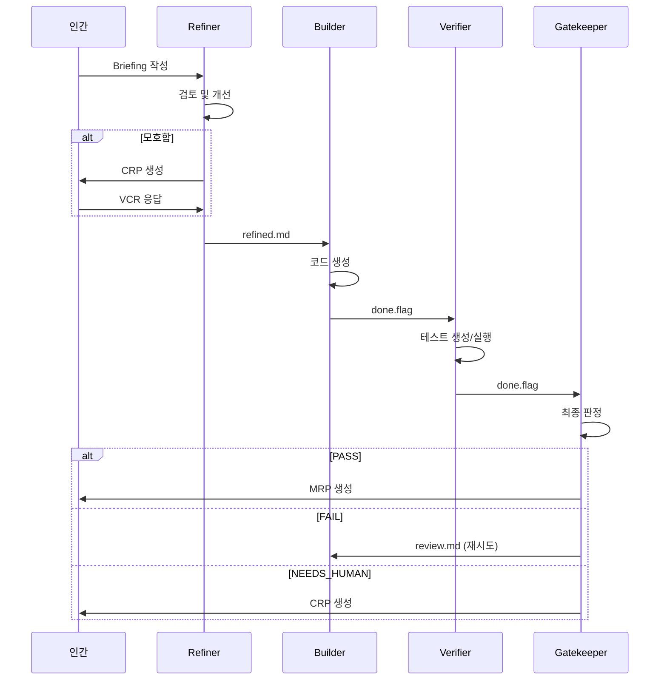
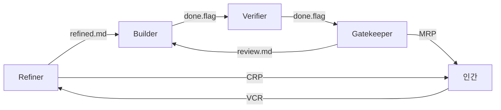

# 에이전트 이해하기

네 개의 에이전트가 어떻게 동작하고 협력하는지 자세히 알아봅니다.

## 에이전트 파이프라인



## Refiner

### 역할

Briefing을 검토하고 개선하는 첫 번째 게이트키퍼입니다.

### 기본 모델

**Haiku** - 빠른 응답, 비용 효율적

?> Settings에서 Sonnet이나 Opus로 변경 가능

### 입력

- `briefing/raw.md` - 인간이 작성한 원본 Briefing

### 출력

1. `briefing/refined.md` - 검토/개선된 Briefing
2. `briefing/clarifications.json` - 해석 및 보완 내용
3. `briefing/log.md` - 검토 근거 및 변경 사항

### 행동 규칙

#### 1. 충분한 Briefing

```markdown
**입력 (raw.md):**
# Hello Function

## 요구사항
- sayHello 함수 생성
- 파라미터: name (string)
- 반환: "Hello, {name}!"

**출력 (refined.md):**
[원본 그대로 복사]

**clarifications.json:**
{}

**log.md:**
Briefing이 충분히 명확합니다. 추가 개선 없이 다음 단계로 진행합니다.
```

#### 2. 자동 개선 가능

**허용된 자동 개선:**

| 항목 | 예시 |
|------|------|
| 숫자 기본값 | "적절한 제한" → "분당 60회" |
| 네이밍 컨벤션 | 프로젝트 스타일 적용 |
| 파일 경로 | 프로젝트 구조에 맞게 |

```markdown
**입력 (raw.md):**
- 적절한 rate limiting 적용

**출력 (refined.md):**
- IP 기반 rate limiting (분당 60회)

**clarifications.json:**
{
  "rate_limit": {
    "interpreted_as": "60 requests per minute per IP",
    "rationale": "일반적인 API 기본값 적용"
  }
}

**log.md:**
'적절한'을 구체적인 값(60/분)으로 보완했습니다.
이는 일반적인 웹 API 표준값입니다.
```

**금지된 자동 개선:**

| 항목 | 이유 |
|------|------|
| 아키텍처 결정 | 인간 판단 필요 |
| 외부 의존성 추가 | 프로젝트 정책 확인 필요 |
| 보안 관련 사항 | 리스크 판단 필요 |

#### 3. 모호한 Briefing → CRP

```json
{
  "crp_id": "crp-001",
  "created_by": "refiner",
  "type": "clarification",
  "question": "Rate limiting을 어떤 기준으로 적용할까요?",
  "context": "briefing에 '적절한 rate limiting'이라고만 명시됨",
  "options": [
    {
      "id": "A",
      "label": "IP당 분당 60회",
      "description": "일반적인 API 기본값",
      "risk": "낮음"
    },
    {
      "id": "B",
      "label": "사용자당 분당 100회",
      "description": "인증된 사용자 기준",
      "risk": "인증 시스템 필요"
    }
  ],
  "recommendation": "A"
}
```

### 설정 (refiner.json)

```json
{
  "model": "haiku",
  "auto_fill": {
    "allowed": ["numeric_defaults", "naming", "file_paths"],
    "forbidden": ["architecture", "external_deps", "security"]
  },
  "delegation_keywords": ["적당히", "알아서", "합리적으로"],
  "max_refinement_iterations": 2
}
```

## Builder

### 역할

코드를 구현하는 핵심 에이전트입니다.

### 기본 모델

**Sonnet** - 코드 생성에 최적화된 균형

### 입력

1. `briefing/refined.md` - Refiner가 검토한 Briefing
2. `briefing/clarifications.json` - 해석 내용
3. (재시도 시) `gatekeeper/review.md` - 피드백

### 출력

1. 프로젝트 루트에 코드 파일 생성/수정
2. `builder/output/` - 변경된 파일 목록
3. `builder/log.md` - 설계 근거
4. `builder/done.flag` - 완료 신호

### 행동 규칙

#### 1. Refined Briefing 충실히 구현

```typescript
// refined.md의 요구사항:
// - sayHello 함수
// - 파라미터: name (string)
// - 반환: "Hello, {name}!"

export function sayHello(name: string): string {
  return `Hello, ${name}!`;
}
```

#### 2. 설계 근거 기록 (log.md)

```markdown
# Builder Log - run-20240126-143022

## 설계 결정

### 1. 파일 위치
- 파일: src/utils/hello.ts
- 이유: 프로젝트의 유틸리티 함수는 src/utils/에 위치

### 2. 타입 안전성
- TypeScript strict mode 준수
- 명시적 반환 타입 정의

### 3. 에러 처리
- name이 빈 문자열인 경우: "Hello, !" 반환 (briefing에 명시 없음)
- 추가 검증은 Verifier에서 필요 시 제안될 것

## 구현 완료
- src/utils/hello.ts 생성
- 총 5줄
```

#### 3. 기존 프로젝트 스타일 준수

Builder는 기존 코드베이스를 분석하여 일관된 스타일을 유지합니다:

- 네이밍 컨벤션
- 폴더 구조
- Import 순서
- 코드 포매팅

### 재시도 시 동작

Gatekeeper가 FAIL 판정을 내리면:

1. `gatekeeper/review.md` 읽기
2. 피드백 반영하여 재구현
3. `log.md`에 변경 사항 기록

```markdown
# Builder Log - Iteration 2

## Gatekeeper 피드백
- 빈 문자열 처리 필요
- 에러 케이스 명시 필요

## 변경 사항
- name이 빈 문자열이면 Error throw
- 타입 가드 추가

## 재구현 완료
```

### 설정 (builder.json)

```json
{
  "model": "sonnet",
  "style": {
    "prefer_libraries": [],
    "avoid_libraries": [],
    "code_style": "default"
  },
  "constraints": {
    "max_file_size_lines": 500,
    "require_types": false
  }
}
```

## Verifier

### 역할

테스트를 생성하고 실행하여 코드를 검증합니다.

### 기본 모델

**Haiku** - 빠른 테스트 생성

### 입력

1. `briefing/refined.md` - 요구사항
2. `builder/output/` - 생성된 코드
3. `builder/log.md` - 설계 근거

### 출력

1. `verifier/tests/` - 테스트 파일
2. `verifier/results.json` - 테스트 결과
3. `verifier/log.md` - 검증 로그
4. `verifier/done.flag` - 완료 신호

### 테스트 전략

#### 1. Happy Path 테스트

```typescript
// verifier/tests/hello.test.ts
import { sayHello } from '../src/utils/hello';

describe('sayHello', () => {
  it('should return greeting with name', () => {
    expect(sayHello('World')).toBe('Hello, World!');
  });

  it('should work with different names', () => {
    expect(sayHello('Alice')).toBe('Hello, Alice!');
    expect(sayHello('Bob')).toBe('Hello, Bob!');
  });
});
```

#### 2. Edge Cases 테스트

```typescript
describe('sayHello - edge cases', () => {
  it('should handle empty string', () => {
    expect(() => sayHello('')).toThrow();
  });

  it('should handle special characters', () => {
    expect(sayHello('世界')).toBe('Hello, 世界!');
  });

  it('should handle very long names', () => {
    const longName = 'A'.repeat(1000);
    expect(sayHello(longName)).toBe(`Hello, ${longName}!`);
  });
});
```

#### 3. Adversarial Testing

`config.verifier.adversarial.enabled: true`인 경우:

```typescript
describe('sayHello - adversarial', () => {
  it('should handle null (타입 우회)', () => {
    // @ts-ignore
    expect(() => sayHello(null)).toThrow();
  });

  it('should handle undefined', () => {
    // @ts-ignore
    expect(() => sayHello(undefined)).toThrow();
  });

  it('should handle number', () => {
    // @ts-ignore
    expect(() => sayHello(123)).toThrow();
  });
});
```

### 테스트 결과 (results.json)

```json
{
  "total": 10,
  "passed": 8,
  "failed": 2,
  "coverage": 85,
  "failures": [
    {
      "test": "should handle empty string",
      "reason": "Expected error but got 'Hello, !'"
    },
    {
      "test": "should handle null",
      "reason": "Expected error but got 'Hello, null!'"
    }
  ],
  "edge_cases_tested": [
    "empty string",
    "special characters",
    "long names",
    "null",
    "undefined",
    "number"
  ],
  "adversarial_findings": [
    "타입 검증이 런타임에 수행되지 않음"
  ]
}
```

### 설정 (verifier.json)

```json
{
  "model": "haiku",
  "test_coverage": {
    "min_percentage": 80,
    "require_edge_cases": true,
    "require_error_cases": true
  },
  "adversarial": {
    "enabled": true,
    "max_attack_vectors": 5
  }
}
```

## Gatekeeper

### 역할

전체 결과물을 검토하고 최종 판정을 내립니다.

### 기본 모델

**Sonnet** - 신중한 판단 필요

### 입력

모든 아티팩트:
- `briefing/` - 전체 요구사항
- `builder/` - 구현 결과
- `verifier/` - 테스트 결과
- `vcr/` - 인간 결정 (있는 경우)
- `state.json` - 현재 상태

### 출력

1. `gatekeeper/review.md` - 리뷰 코멘트
2. `gatekeeper/verdict.json` - 판정 결과
3. (PASS인 경우) `mrp/` - 최종 결과물

### 판정 기준

| 기준 | 설명 |
|------|------|
| ✅ 테스트 통과 | 모든 테스트 PASS |
| ✅ 요구사항 충족 | Briefing의 모든 항목 구현 |
| ✅ 코드 품질 | 읽기 쉽고 유지보수 가능 |
| ✅ 보안 | 취약점 없음 |

### 판정 결과

#### PASS

```json
{
  "verdict": "PASS",
  "reason": "모든 기준 충족",
  "test_results": {
    "total": 10,
    "passed": 10,
    "failed": 0
  },
  "code_quality": "good",
  "security_issues": [],
  "timestamp": "2024-01-26T14:35:00Z"
}
```

→ MRP 생성

#### FAIL

```json
{
  "verdict": "FAIL",
  "reason": "테스트 2개 실패",
  "issues": [
    "빈 문자열 처리 누락",
    "타입 검증 누락"
  ],
  "suggestions": [
    "sayHello 함수에 입력 검증 추가",
    "런타임 타입 체크 구현"
  ],
  "iteration": 1,
  "timestamp": "2024-01-26T14:35:00Z"
}
```

→ `review.md` 작성, Builder 재시도

#### NEEDS_HUMAN

```json
{
  "verdict": "NEEDS_HUMAN",
  "reason": "보안 관련 결정 필요",
  "question": "XSS 방지를 위해 HTML 이스케이프를 적용할까요?",
  "context": "name 파라미터가 웹 페이지에 직접 출력될 수 있음",
  "timestamp": "2024-01-26T14:35:00Z"
}
```

→ CRP 생성

### MRP 생성 (PASS인 경우)

```
mrp/
├── summary.md          # 요약
├── code/               # 최종 코드 스냅샷
│   └── src/
│       └── utils/
│           └── hello.ts
├── tests/              # 테스트 파일
│   └── hello.test.ts
└── evidence.json       # 증거
```

**summary.md:**

```markdown
# Merge-Readiness Pack

## Run 정보
- Run ID: run-20240126-143022
- 총 iteration: 1
- 완료 시간: 2024-01-26T14:35:00Z

## 변경 사항
- `src/utils/hello.ts` 추가 (5줄)

## 테스트 결과
- 총 10개 테스트
- 통과: 10
- 실패: 0
- 커버리지: 100%

## 설계 결정
1. TypeScript strict mode 준수
2. 입력 검증 포함

## 비용
- Total: $0.012
  - Refiner: $0.001
  - Builder: $0.005
  - Verifier: $0.003
  - Gatekeeper: $0.003

## 리뷰 통과 사유
- 모든 테스트 통과
- 요구사항 100% 충족
- 코드 품질 양호
- 보안 이슈 없음
```

### 설정 (gatekeeper.json)

```json
{
  "model": "sonnet",
  "pass_criteria": {
    "tests_passing": true,
    "no_critical_issues": true,
    "min_test_coverage": 80
  },
  "max_iterations": 3,
  "auto_crp_triggers": [
    "security_concern",
    "breaking_change",
    "external_dependency_addition"
  ]
}
```

## 에이전트 간 통신

### 파일 기반 조율



### Done Flag 메커니즘

각 에이전트는 완료 시 `done.flag` 파일을 생성합니다:

```bash
# Builder 완료
touch .dure/runs/{run_id}/builder/done.flag

# Verifier가 이를 감지하고 시작
inotifywait -e create .dure/runs/{run_id}/builder/
```

이는:
- ✅ 명확한 순서 보장
- ✅ 디버깅 용이
- ✅ 중간 상태 확인 가능

## 다음 단계

- [CRP 응답](/guide/responding-to-crp.md) - CRP 처리 방법
- [MRP 검토](/guide/reviewing-mrp.md) - 최종 결과 검토 방법
- [실행 흐름](/architecture/execution-flow.md) - 상세 실행 과정
