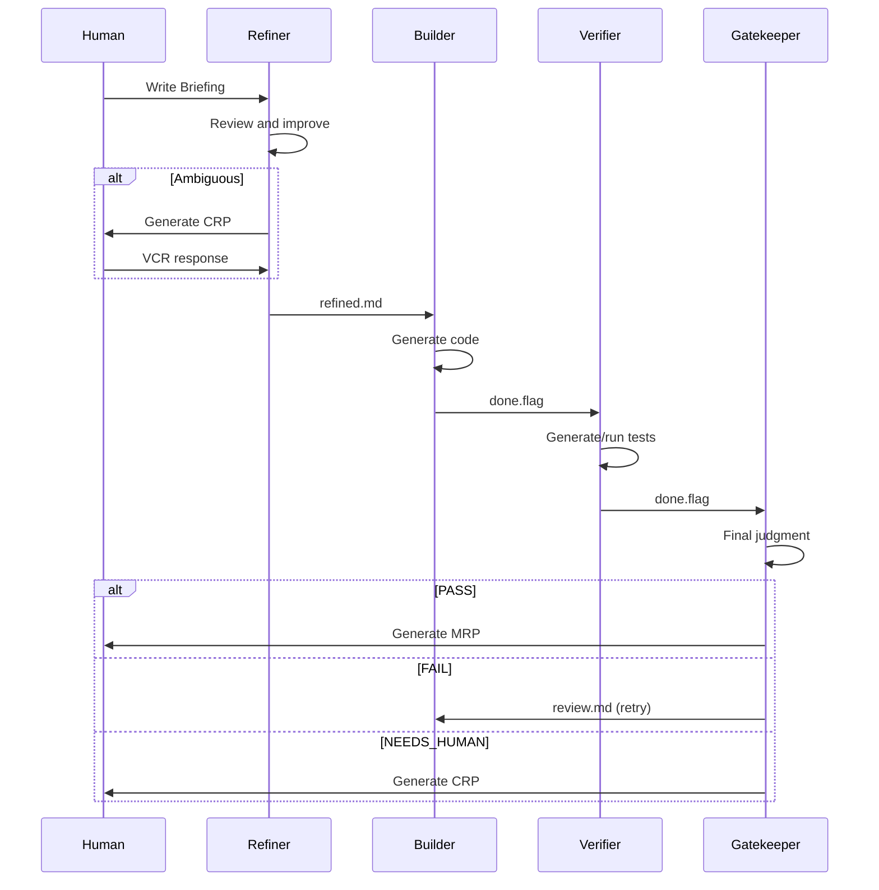
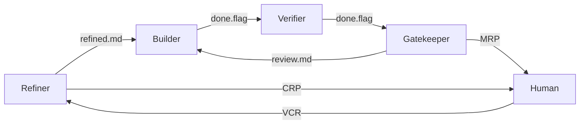

# Understanding Agents

Learn in detail how the four agents work and collaborate.

## Agent Pipeline



## Refiner

### Role

The first gatekeeper that reviews and improves the Briefing.

### Default Model

**Haiku** - Fast response, cost-effective

?> Can be changed to Sonnet or Opus in Settings

### Input

- `briefing/raw.md` - Original Briefing written by human

### Output

1. `briefing/refined.md` - Reviewed/improved Briefing
2. `briefing/clarifications.json` - Interpretations and supplements
3. `briefing/log.md` - Review rationale and changes

### Behavior Rules

#### 1. Sufficient Briefing

```markdown
**Input (raw.md):**
# Hello Function

## Requirements
- Create sayHello function
- Parameter: name (string)
- Return: "Hello, {name}!"

**Output (refined.md):**
[Copy original as-is]

**clarifications.json:**
{}

**log.md:**
Briefing is sufficiently clear. Proceeding to next step without additional improvements.
```

#### 2. Auto-improvement Possible

**Allowed Auto-improvements:**

| Item | Example |
|------|---------|
| Numeric defaults | "appropriate limit" → "60 per minute" |
| Naming conventions | Apply project style |
| File paths | Match project structure |

```markdown
**Input (raw.md):**
- Apply appropriate rate limiting

**Output (refined.md):**
- IP-based rate limiting (60 per minute)

**clarifications.json:**
{
  "rate_limit": {
    "interpreted_as": "60 requests per minute per IP",
    "rationale": "Applied common API default value"
  }
}

**log.md:**
Supplemented 'appropriate' with concrete value (60/minute).
This is a standard value for common web APIs.
```

**Forbidden Auto-improvements:**

| Item | Reason |
|------|--------|
| Architecture decisions | Human judgment required |
| Adding external dependencies | Project policy verification needed |
| Security-related matters | Risk assessment needed |

#### 3. Ambiguous Briefing → CRP

```json
{
  "crp_id": "crp-001",
  "created_by": "refiner",
  "type": "clarification",
  "question": "What criteria should rate limiting be based on?",
  "context": "Briefing only specifies 'appropriate rate limiting'",
  "options": [
    {
      "id": "A",
      "label": "60 per minute per IP",
      "description": "Common API default",
      "risk": "low"
    },
    {
      "id": "B",
      "label": "100 per minute per user",
      "description": "Authenticated user basis",
      "risk": "authentication system required"
    }
  ],
  "recommendation": "A"
}
```

### Configuration (refiner.json)

```json
{
  "model": "haiku",
  "auto_fill": {
    "allowed": ["numeric_defaults", "naming", "file_paths"],
    "forbidden": ["architecture", "external_deps", "security"]
  },
  "delegation_keywords": ["appropriately", "as needed", "reasonably"],
  "max_refinement_iterations": 2
}
```

## Builder

### Role

The core agent that implements the code.

### Default Model

**Sonnet** - Balanced optimization for code generation

### Input

1. `briefing/refined.md` - Briefing reviewed by Refiner
2. `briefing/clarifications.json` - Interpretation content
3. (On retry) `gatekeeper/review.md` - Feedback

### Output

1. Create/modify code files in project root
2. `builder/output/` - List of changed files
3. `builder/log.md` - Design rationale
4. `builder/done.flag` - Completion signal

### Behavior Rules

#### 1. Faithfully Implement Refined Briefing

```typescript
// Requirements from refined.md:
// - sayHello function
// - Parameter: name (string)
// - Return: "Hello, {name}!"

export function sayHello(name: string): string {
  return `Hello, ${name}!`;
}
```

#### 2. Record Design Rationale (log.md)

```markdown
# Builder Log - run-20240126-143022

## Design Decisions

### 1. File Location
- File: src/utils/hello.ts
- Reason: Project utility functions are located in src/utils/

### 2. Type Safety
- Compliant with TypeScript strict mode
- Explicit return type definition

### 3. Error Handling
- If name is empty string: Returns "Hello, !" (not specified in briefing)
- Additional validation will be suggested by Verifier if needed

## Implementation Complete
- Created src/utils/hello.ts
- Total 5 lines
```

#### 3. Follow Existing Project Style

Builder analyzes the existing codebase to maintain consistent style:

- Naming conventions
- Folder structure
- Import order
- Code formatting

### Behavior on Retry

When Gatekeeper gives a FAIL judgment:

1. Read `gatekeeper/review.md`
2. Re-implement reflecting feedback
3. Record changes in `log.md`

```markdown
# Builder Log - Iteration 2

## Gatekeeper Feedback
- Empty string handling needed
- Error cases need to be explicit

## Changes
- Throw Error if name is empty string
- Added type guard

## Re-implementation Complete
```

### Configuration (builder.json)

```json
{
  "model": "sonnet",
  "style": {
    "prefer_libraries": [],
    "avoid_libraries": [],
    "code_style": "default"
  },
  "constraints": {
    "max_file_size_lines": 500,
    "require_types": false
  }
}
```

## Verifier

### Role

Generates and runs tests to verify the code.

### Default Model

**Haiku** - Fast test generation

### Input

1. `briefing/refined.md` - Requirements
2. `builder/output/` - Generated code
3. `builder/log.md` - Design rationale

### Output

1. `verifier/tests/` - Test files
2. `verifier/results.json` - Test results
3. `verifier/log.md` - Verification log
4. `verifier/done.flag` - Completion signal

### Testing Strategy

#### 1. Happy Path Tests

```typescript
// verifier/tests/hello.test.ts
import { sayHello } from '../src/utils/hello';

describe('sayHello', () => {
  it('should return greeting with name', () => {
    expect(sayHello('World')).toBe('Hello, World!');
  });

  it('should work with different names', () => {
    expect(sayHello('Alice')).toBe('Hello, Alice!');
    expect(sayHello('Bob')).toBe('Hello, Bob!');
  });
});
```

#### 2. Edge Cases Tests

```typescript
describe('sayHello - edge cases', () => {
  it('should handle empty string', () => {
    expect(() => sayHello('')).toThrow();
  });

  it('should handle special characters', () => {
    expect(sayHello('世界')).toBe('Hello, 世界!');
  });

  it('should handle very long names', () => {
    const longName = 'A'.repeat(1000);
    expect(sayHello(longName)).toBe(`Hello, ${longName}!`);
  });
});
```

#### 3. Adversarial Testing

When `config.verifier.adversarial.enabled: true`:

```typescript
describe('sayHello - adversarial', () => {
  it('should handle null (type bypass)', () => {
    // @ts-ignore
    expect(() => sayHello(null)).toThrow();
  });

  it('should handle undefined', () => {
    // @ts-ignore
    expect(() => sayHello(undefined)).toThrow();
  });

  it('should handle number', () => {
    // @ts-ignore
    expect(() => sayHello(123)).toThrow();
  });
});
```

### Test Results (results.json)

```json
{
  "total": 10,
  "passed": 8,
  "failed": 2,
  "coverage": 85,
  "failures": [
    {
      "test": "should handle empty string",
      "reason": "Expected error but got 'Hello, !'"
    },
    {
      "test": "should handle null",
      "reason": "Expected error but got 'Hello, null!'"
    }
  ],
  "edge_cases_tested": [
    "empty string",
    "special characters",
    "long names",
    "null",
    "undefined",
    "number"
  ],
  "adversarial_findings": [
    "Type validation is not performed at runtime"
  ]
}
```

### Configuration (verifier.json)

```json
{
  "model": "haiku",
  "test_coverage": {
    "min_percentage": 80,
    "require_edge_cases": true,
    "require_error_cases": true
  },
  "adversarial": {
    "enabled": true,
    "max_attack_vectors": 5
  }
}
```

## Gatekeeper

### Role

Reviews the overall deliverables and makes the final judgment.

### Default Model

**Sonnet** - Careful judgment required

### Input

All artifacts:
- `briefing/` - Full requirements
- `builder/` - Implementation results
- `verifier/` - Test results
- `vcr/` - Human decisions (if any)
- `state.json` - Current state

### Output

1. `gatekeeper/review.md` - Review comments
2. `gatekeeper/verdict.json` - Judgment result
3. (If PASS) `mrp/` - Final deliverables

### Judgment Criteria

| Criterion | Description |
|-----------|-------------|
| ✅ Tests pass | All tests PASS |
| ✅ Requirements met | All Briefing items implemented |
| ✅ Code quality | Readable and maintainable |
| ✅ Security | No vulnerabilities |

### Judgment Results

#### PASS

```json
{
  "verdict": "PASS",
  "reason": "All criteria met",
  "test_results": {
    "total": 10,
    "passed": 10,
    "failed": 0
  },
  "code_quality": "good",
  "security_issues": [],
  "timestamp": "2024-01-26T14:35:00Z"
}
```

→ Generate MRP

#### FAIL

```json
{
  "verdict": "FAIL",
  "reason": "2 tests failed",
  "issues": [
    "Empty string handling missing",
    "Type validation missing"
  ],
  "suggestions": [
    "Add input validation to sayHello function",
    "Implement runtime type check"
  ],
  "iteration": 1,
  "timestamp": "2024-01-26T14:35:00Z"
}
```

→ Write `review.md`, Builder retry

#### NEEDS_HUMAN

```json
{
  "verdict": "NEEDS_HUMAN",
  "reason": "Security-related decision needed",
  "question": "Should we apply HTML escaping for XSS prevention?",
  "context": "name parameter may be directly output to web page",
  "timestamp": "2024-01-26T14:35:00Z"
}
```

→ Generate CRP

### MRP Generation (If PASS)

```
mrp/
├── summary.md          # Summary
├── code/               # Final code snapshot
│   └── src/
│       └── utils/
│           └── hello.ts
├── tests/              # Test files
│   └── hello.test.ts
└── evidence.json       # Evidence
```

**summary.md:**

```markdown
# Merge-Readiness Pack

## Run Information
- Run ID: run-20240126-143022
- Total iterations: 1
- Completion time: 2024-01-26T14:35:00Z

## Changes
- Added `src/utils/hello.ts` (5 lines)

## Test Results
- Total 10 tests
- Passed: 10
- Failed: 0
- Coverage: 100%

## Design Decisions
1. Compliant with TypeScript strict mode
2. Input validation included

## Cost
- Total: $0.012
  - Refiner: $0.001
  - Builder: $0.005
  - Verifier: $0.003
  - Gatekeeper: $0.003

## Review Pass Reason
- All tests passed
- 100% requirements met
- Good code quality
- No security issues
```

### Configuration (gatekeeper.json)

```json
{
  "model": "sonnet",
  "pass_criteria": {
    "tests_passing": true,
    "no_critical_issues": true,
    "min_test_coverage": 80
  },
  "max_iterations": 3,
  "auto_crp_triggers": [
    "security_concern",
    "breaking_change",
    "external_dependency_addition"
  ]
}
```

## Inter-Agent Communication

### File-Based Coordination



### Done Flag Mechanism

Each agent creates a `done.flag` file upon completion:

```bash
# Builder complete
touch .dure/runs/{run_id}/builder/done.flag

# Verifier detects this and starts
inotifywait -e create .dure/runs/{run_id}/builder/
```

This provides:
- ✅ Clear order guarantee
- ✅ Easy debugging
- ✅ Ability to check intermediate states

## Next Steps

- [Responding to CRP](/guide/responding-to-crp.md) - How to handle CRP
- [Reviewing MRP](/guide/reviewing-mrp.md) - How to review final results
- [Execution Flow](/architecture/execution-flow.md) - Detailed execution process
