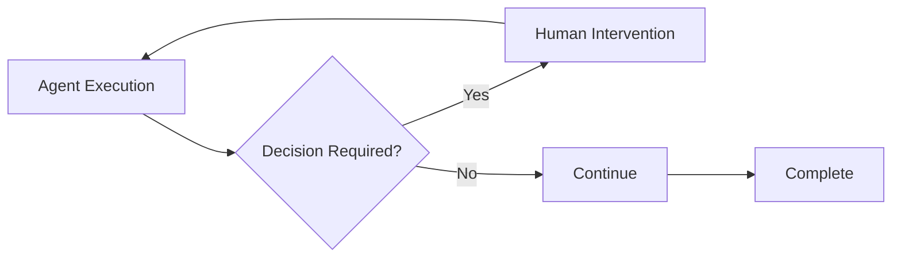
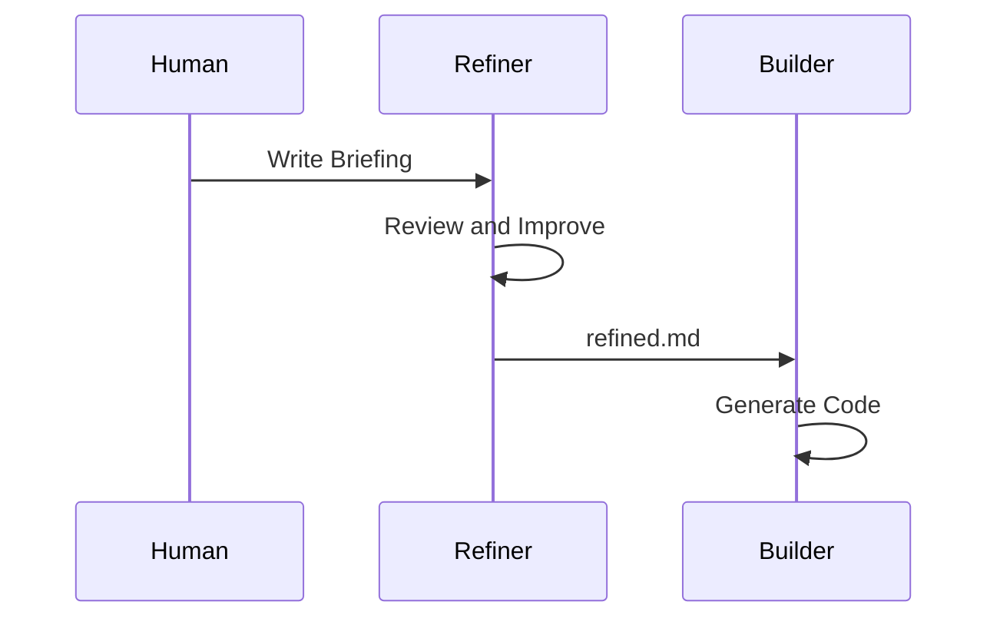
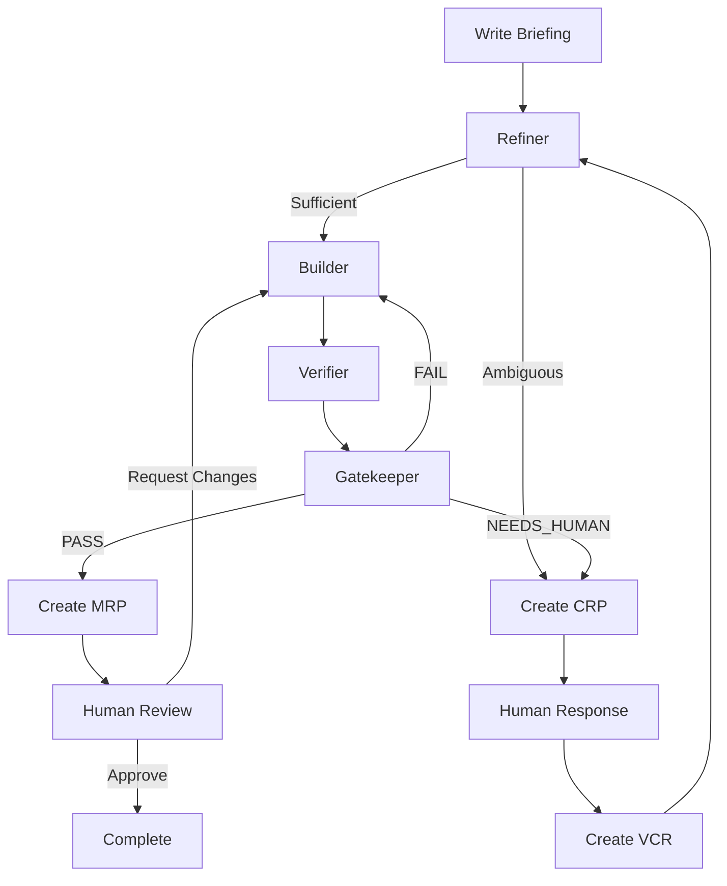

# Mermaid Test

## Simple Flowchart

```mermaid
graph LR
    A[Agent Execution] --> B{Decision Required?}
    B -->|Yes| C[Human Intervention]
    B -->|No| D[Continue]
    C --> A
    D --> E[Complete]
```

## Sequence Diagram

```mermaid
sequenceDiagram
    participant Human
    participant Refiner
    participant Builder

    Human->>Refiner: Write Briefing
    Refiner->>Refiner: Review and Improve
    Refiner->>Builder: refined.md
    Builder->>Builder: Generate Code
```

## Complex Flow

```mermaid
graph TD
    A[Write Briefing] --> B[Refiner]
    B -->|Sufficient| C[Builder]
    B -->|Ambiguous| D[Create CRP]
    D --> E[Human Response]
    E --> F[Create VCR]
    F --> B
    C --> G[Verifier]
    G --> H[Gatekeeper]
    H -->|PASS| I[Create MRP]
    H -->|FAIL| C
    H -->|NEEDS_HUMAN| D
    I --> J[Human Review]
    J -->|Approve| K[Complete]
    J -->|Request Changes| C
```
