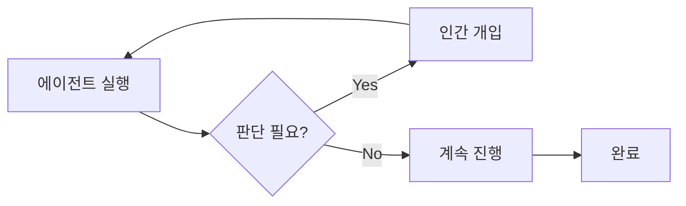
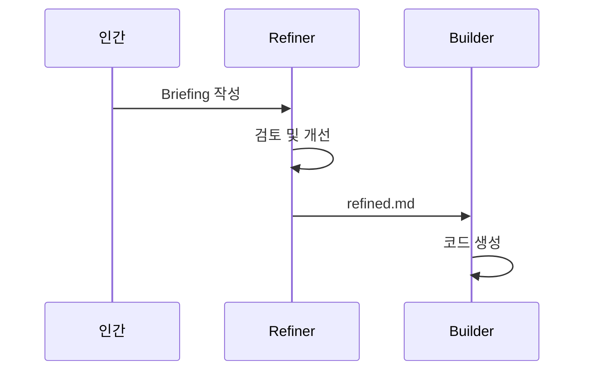
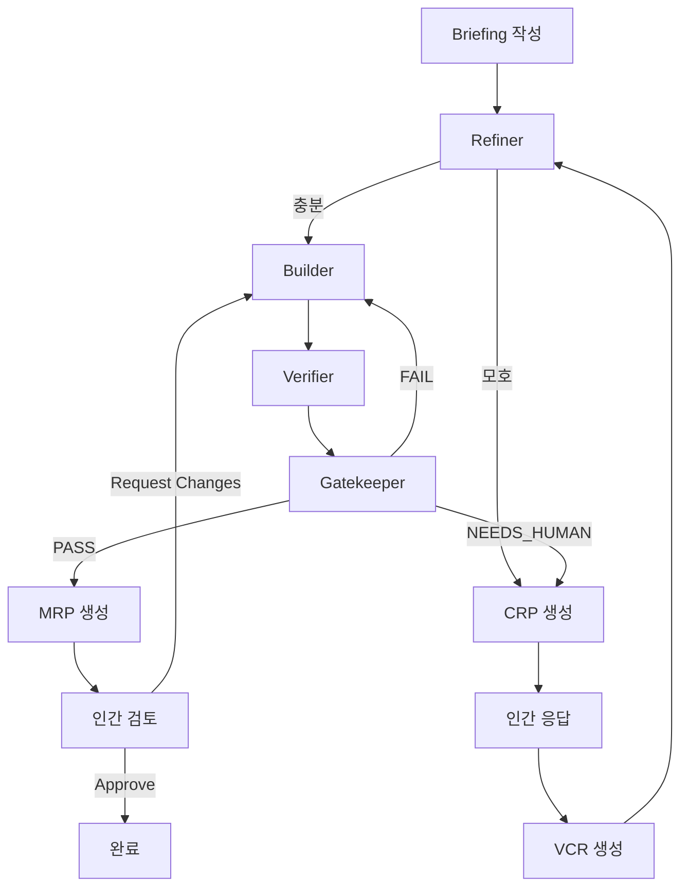

# Mermaid 테스트

## 간단한 플로우차트

```mermaid
graph LR
    A[에이전트 실행] --> B{판단 필요?}
    B -->|Yes| C[인간 개입]
    B -->|No| D[계속 진행]
    C --> A
    D --> E[완료]
```

## 시퀀스 다이어그램

```mermaid
sequenceDiagram
    participant 인간
    participant Refiner
    participant Builder

    인간->>Refiner: Briefing 작성
    Refiner->>Refiner: 검토 및 개선
    Refiner->>Builder: refined.md
    Builder->>Builder: 코드 생성
```

## 복잡한 플로우

```mermaid
graph TD
    A[Briefing 작성] --> B[Refiner]
    B -->|충분| C[Builder]
    B -->|모호| D[CRP 생성]
    D --> E[인간 응답]
    E --> F[VCR 생성]
    F --> B
    C --> G[Verifier]
    G --> H[Gatekeeper]
    H -->|PASS| I[MRP 생성]
    H -->|FAIL| C
    H -->|NEEDS_HUMAN| D
    I --> J[인간 검토]
    J -->|Approve| K[완료]
    J -->|Request Changes| C
```
